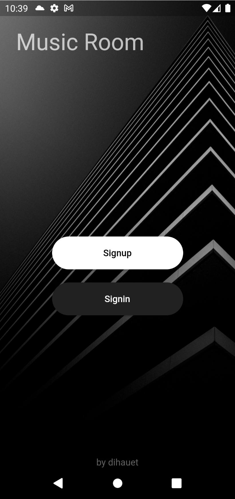
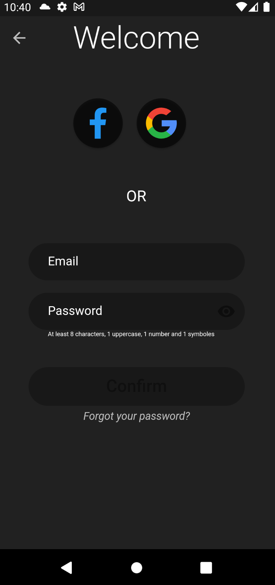
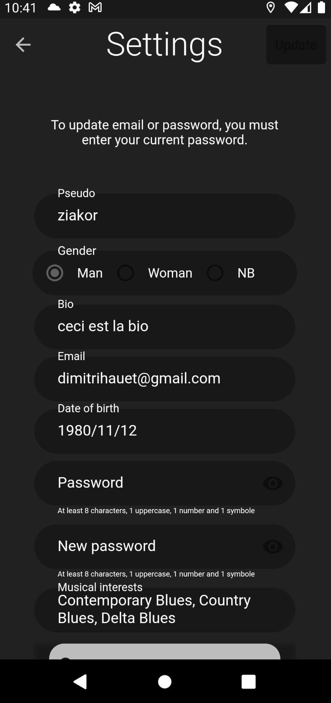
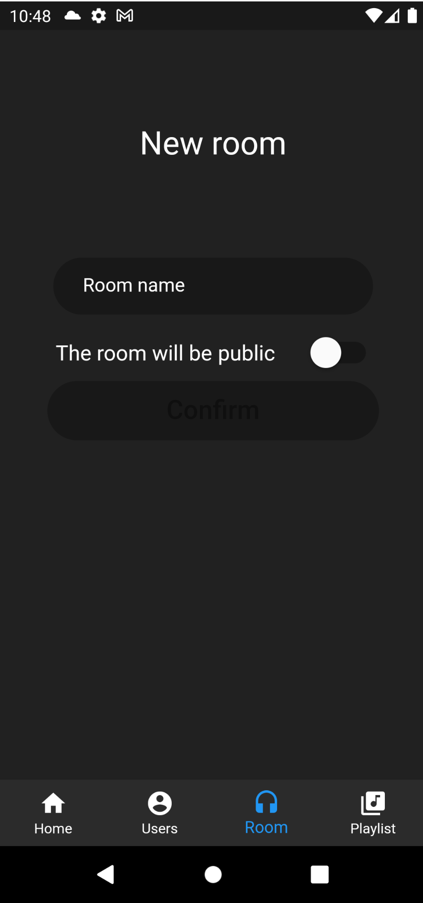
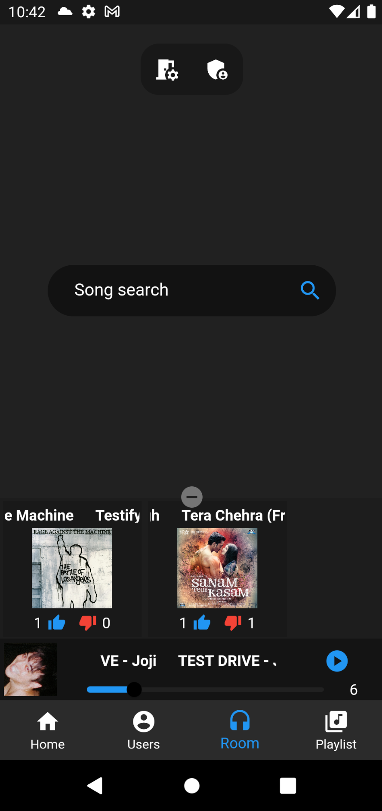
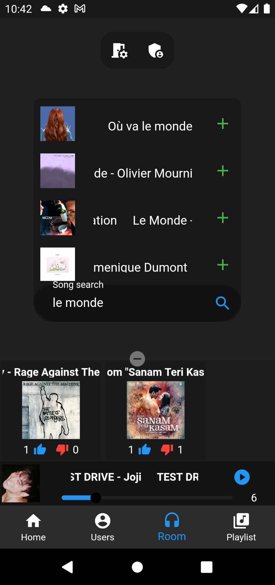
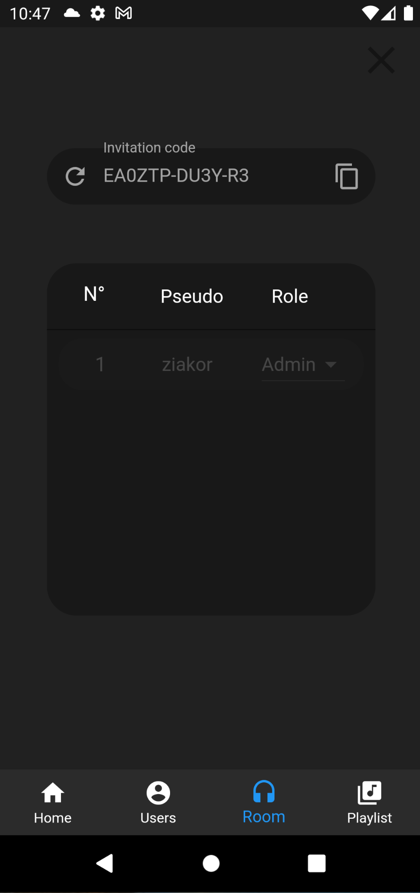
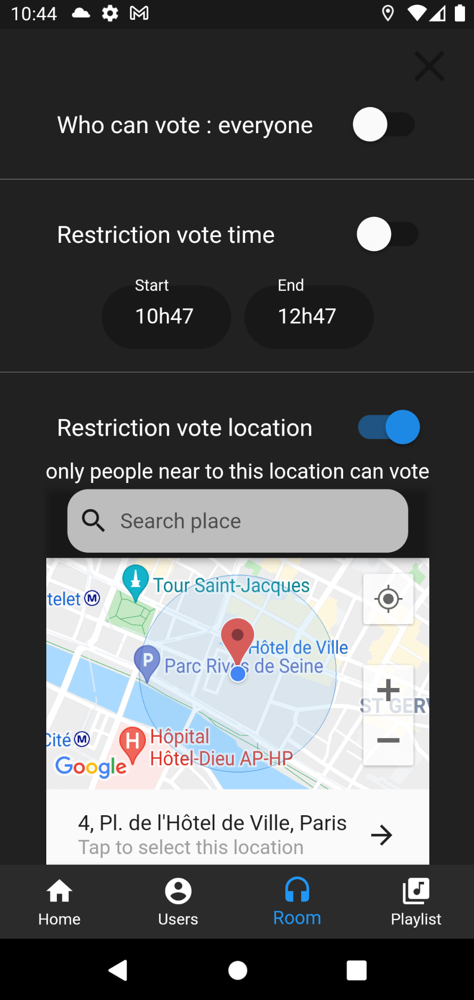

# music_room

Create a complete mobile app of collaborative playlist using the SDK and API of Spotify. On the menu, mobile native development, back-end development and creation of API REST.

The subject is [here](./subject_musicRoom.pdf).

---

> Sign with Google, Facebook and Email/Password.
> Email validation when Sign with Email/Password.
> Forget password.

>Settings

> Room/Playlist public and private.
> Vote in room and add song.

> License management in Room and playlist.
 